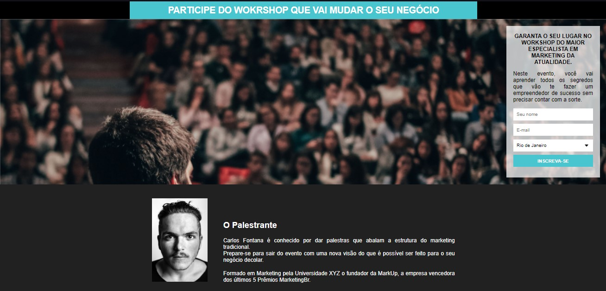

<h1 align="center">
 
  Evolução
 
</h1>

Neste repositório estarei postando toda a evolução do aprendizado, bem como desafios, do curso do ProgramadorBR. Incluindo alguns desafios e tutoriais disponíveis pela internet, visando melhor fixação e treinamento da linguagem.

# 📷 Página de Cadastro com HTML 5 e CSS 3

Tutorial disponibilizado pelo canal <a href="https://www.youtube.com/watch?v=Q68vbJplf7I" target="_blank">GirlCoding.</a>

Consiste em um página de cadastro com HTML5 e CSS3

  

## 📷 Desafio Workshop - ProgramadorBR

Consiste em um página para captação de clientes, usando uma ferramenta chamada <a href="https://mailchimp.com/pt-br/" target="_blank">MailChimp</a>, para inserção de dados do formulário sem a necessidade de banco de dados. 

  

